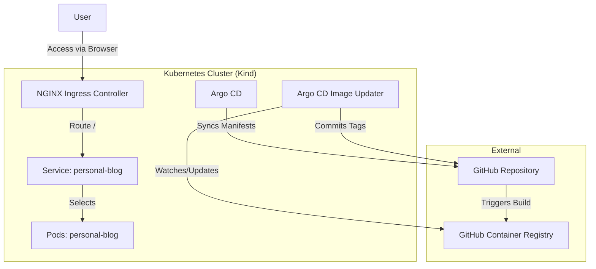

This is a [Next.js](https://nextjs.org) project bootstrapped with [`create-next-app`](https://nextjs.org/docs/app/api-reference/cli/create-next-app).

## Project Objective

The goal of this project is to build a scalable and automated personal blog platform using Next.js, running on a local Kubernetes cluster tailored for GitOps workflows. It leverages **Kind** for local clustering, **Argo CD** for continuous delivery, and **Argo CD Image Updater** for automating image updates from **GitHub Container Registry (GHCR)**.

## Architecture



## Documentation

- [Introduction to Kubernetes & Cheatsheet](docs/KUBERNETES_CHEATSHEET.md)
- [Argo CD Management & Cheatsheet](docs/ARGOCD_CHEATSHEET.md)
- [Cluster Setup Implementation Plan](docs/IMPLEMENTATION_PLAN.md)
- [Journey Comments & Logs](docs/JOURNEY_COMMENT.md)

## Getting Started

### Prerequisites

- [Docker](https://docs.docker.com/get-docker/)
- [Kind](https://kind.sigs.k8s.io/docs/user/quick-start/)
- [Kubectl](https://kubernetes.io/docs/tasks/tools/)

### Automated Setup

We have automated the entire cluster creation and application deployment process.

1.  **Start the Cluster:**
    ```bash
    make up
    ```
    *You will be prompted for your GitHub Username and PAT (with `read:packages` and `repo` scopes).*

2.  **Access the Application:**
    Open [http://personal-blog.local](http://personal-blog.local) in your browser.

    *Note: You may need to add `127.0.0.1 personal-blog.local` to your `/etc/hosts` file.*

3.  **Manage Argo CD:**
    *   **UI:** `make port-forward` -> [https://localhost:8080](https://localhost:8080)
    *   **Password:** `make password`

4.  **Stop the Cluster:**
    ```bash
    make down
    ```

## Development

This is a [Next.js](https://nextjs.org) project.

```bash
npm run dev
# or
yarn dev
```

Open [http://localhost:3000](http://localhost:3000) with your browser to see the result.

## Import Medium posts

1. Install dependencies:

```bash
npm install
```

2. Import posts from a Medium user:

```bash
npm run import:medium -- your-medium-username
```

